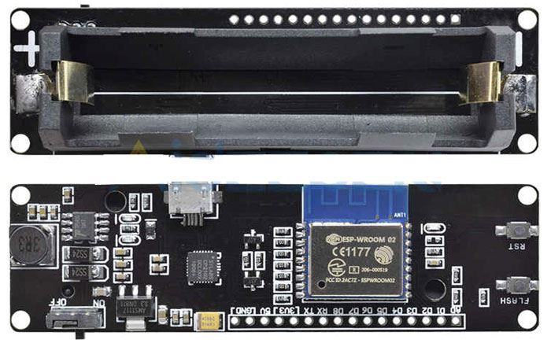
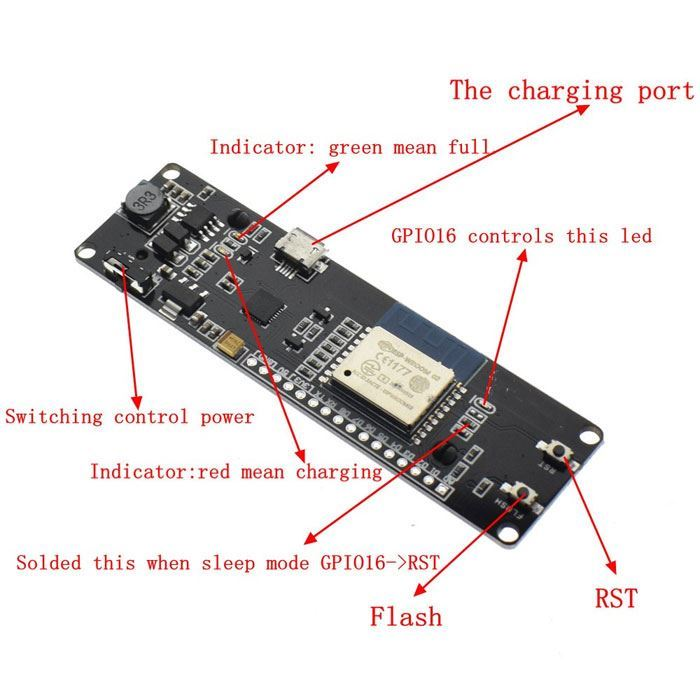

# ESP-MoBl

For a game I organised for my friends, I needed something that could send a message in morse code by flashing a string of xmass lights. 

So I built a nice solution using a board I've had around for a while, which has an ESP8266 chip and an 18650 battery holder, so it's pretty self-sufficient.

## Functionality

On power up, the LED will remain on until the unit has initialised (which should take less than a second). If the LED stays on indefinitely, it indicates some kind of problem during initialisation.

It will then start flashing the programmed message. The default message is, of course, `HELLO WORLD`.

The device will create a WiFi AP, default name is `ESP-MOBL-xxxxxxxx` (where `xxxxxxxx` is the unique chip ID), default password is `TopSecret`. 

The AP hosts a captive portal where you can enter the message to be displayed. The only supported characters are letters `A` to `Z`, numbers `0` to `9` and space. All other characters will be ignored. The message is stored in flash memory, so it's remembered between reboots.

## Hardware

I used this board with ESP8266 and slot for 18650 battery from Wemos. Unfortunately there is no specific type mentioned, but if you search for "ESP8266 18650" it should show you the correct board.

I like this board because it covers all my needs. It has battery, power and charging circuitry, so I don't have to figure it out myself. The battery can be charged via the MicroUSB port.

I used a string of fairy lights for signalling. They only draw about 20 mA at 3.3 V, so it's possible to power them directly from the GPIO pin. The lights are connected to pin D2. 

On most boards D2 pin controls the built-in LED, on this board the LED is connected to pin D0 (GPIO16). Also, the built-in is inverted (lights on `LOW`), so the code takes care of that and controls both pins in sync (see the `setLed` method).

I designed a [simple case](./case/mobl_case.stl) for 3D printing.

## Software

I wrote the code in Platform.io, but it should work in the Arduino IDE as well. You may want to change the `#define` values in `main.cpp` to set your own SSID and password.